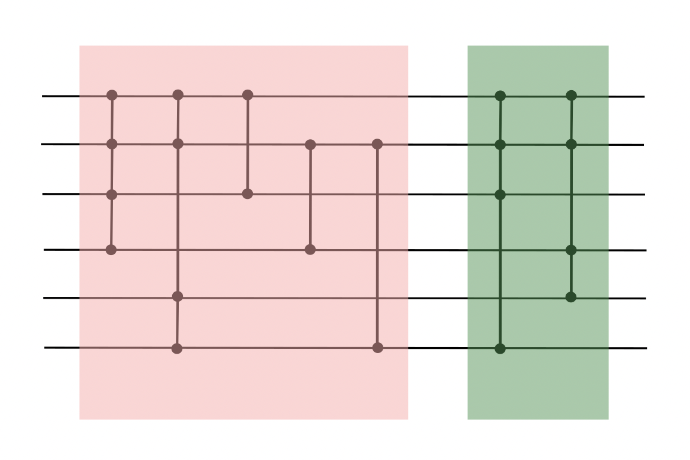

# tailgating

<p align="center">

</p>

## Overview

This repo includes a basic example implemented in PennyLane highlighting the tailgating procedure. I also make use the `autohf` library ([Github repo](https://github.com/Lucaman99/autohf)): the prototype version of the `pennylane.hf` module, as well as the `bigvqe` library ([Github repo](https://github.com/Lucaman99/bigvqe)): a package for faster computation of sparse fermionic Hamiltonians.

This simply allows us to return the value of the gradient, the value of the cost function, and the updated parameters simultaneously when performing gradient descent.

## Installation

To install this package, run:

```
python3 setup.py build_ext --inplace install --user
```

## Cite

Please cite our paper!
